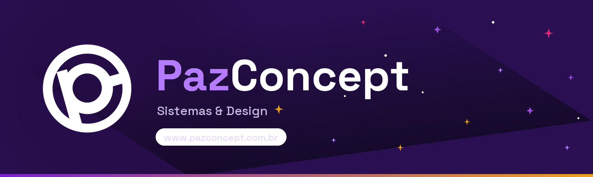
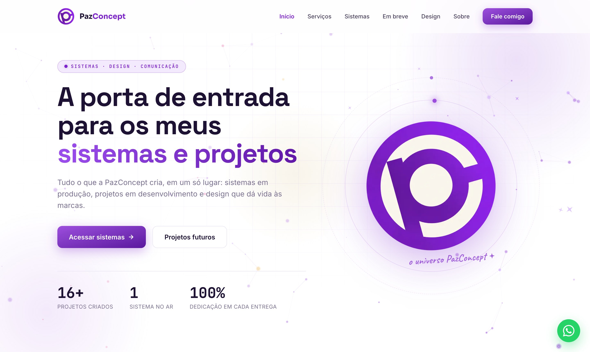
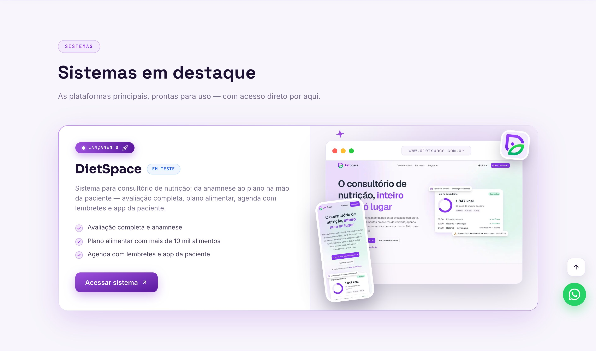
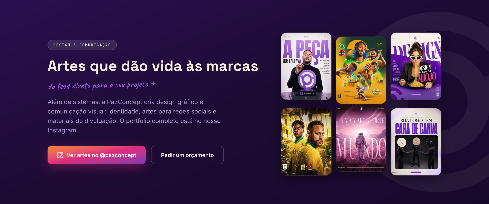
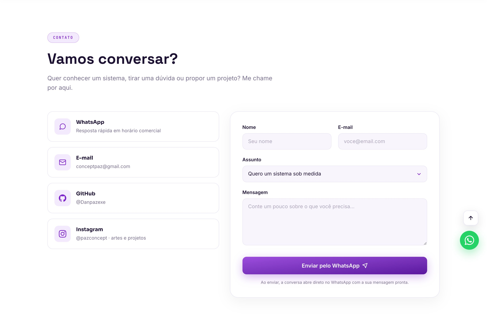
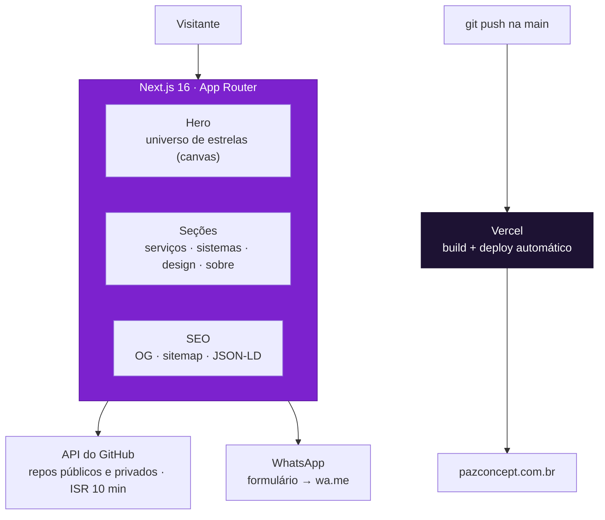

<p align="center">
  
</p>

<p align="center">
  <b>A porta de entrada dos sistemas e projetos da PazConcept.</b><br>
  Sistemas em produção, projetos em desenvolvimento e o design que dá vida às marcas —<br>
  tudo num só lugar, dentro de um universo interativo de estrelas.
</p>

<p align="center">
  <a href="https://www.pazconcept.com.br"><b>pazconcept.com.br</b></a>
</p>

<p align="center">
  
  
  
  
  
  
  
</p>

---

## Telas

<table>
  <tr>
    <td width="50%"><br><sub><b>Início</b> — universo de estrelas interativo que reage ao mouse</sub></td>
    <td width="50%"><br><sub><b>Sistemas</b> — vitrine de lançamento do DietSpace com telas reais</sub></td>
  </tr>
  <tr>
    <td><br><sub><b>Design</b> — artes reais do feed <a href="https://www.instagram.com/pazconcept">@pazconcept</a></sub></td>
    <td><br><sub><b>Contato</b> — formulário que abre a conversa pronta no WhatsApp</sub></td>
  </tr>
</table>

## Recursos

- **Universo interativo** — céu de estrelas desenhado em canvas puro: constelações, paralaxe 3D, repulsão ao mouse, estrelas cadentes e explosões de faíscas ao clicar. Pausa sozinho fora da tela e respeita `prefers-reduced-motion`.
- **Vitrine de lançamento** — cada sistema em destaque aparece em mockup de navegador com telas reais + celular flutuante (o DietSpace é o primeiro; os próximos entram só editando a config).
- **Projetos automáticos** — a contagem de projetos vem da API do GitHub (públicos e privados via token), revalidada a cada 10 minutos (ISR).
- **Design & comunicação** — seção dedicada ao braço de design da marca, com galeria real do feed do Instagram.
- **Contato sem atrito** — formulário sem backend: valida, monta a mensagem e abre direto no WhatsApp.
- **Performance de verdade** — 60 fps comprovados em testes automatizados (Puppeteer com CPU 4× mais lenta e "usuário chato" simulado), zero erros de console e Lighthouse 99.
- **SEO completo** — Open Graph, sitemap, robots, JSON-LD, favicon multi-tamanho, headers de segurança e Web Analytics.

## Arquitetura



## Stack

- **[Next.js 16](https://nextjs.org)** (App Router) + React 19 + TypeScript
- **[Tailwind CSS v4](https://tailwindcss.com)** com os tokens da marca em `@theme`
- **[Framer Motion 12](https://motion.dev)** — reveals, parallax e barra de progresso de rolagem
- **Canvas 2D puro** para o universo de estrelas (zero dependências)
- **[Vercel](https://vercel.com)** — deploy automático a cada push + Web Analytics
- Fontes via `next/font`: Space Grotesk · Sora · Inter · JetBrains Mono · Caveat

## Rodando localmente

**Requisitos:** Node.js 22+, npm.

```bash
# 1. Clone e instale
git clone https://github.com/Danpazexe/PazConcept-web.git
cd PazConcept-web
npm install

# 2. (Opcional) Token do GitHub — inclui os repositórios privados na contagem
cp .env.example .env.local
#   GITHUB_TOKEN — crie em github.com/settings/tokens (leitura de repositórios)

# 3. Suba o dev server
npm run dev
```

Acesse [localhost:3000](http://localhost:3000). Sem o token o site funciona normalmente, contando apenas os repositórios públicos.

## Personalização

Quase tudo se ajusta em um único arquivo: [`data/config.ts`](data/config.ts)

| O quê | Onde |
| --- | --- |
| Marca, WhatsApp, e-mail e redes | `SITE` |
| Sistemas em destaque (vitrine) | `DESTAQUES` |
| Projetos futuros | `FUTUROS` |
| Repositórios ocultos e forks | `reposOcultos` · `mostrarForks` |

Outros pontos editáveis estão marcados com `EDITE AQUI` no código. A logo original fica em `public/logo-pc.png`, com variações (P&B e cores) em `public/variacoes/`.

## Scripts

| Script | Descrição |
| --- | --- |
| `npm run dev` | Servidor de desenvolvimento |
| `npm run build` | Build de produção |
| `npm start` | Servidor de produção |

## Estrutura (resumo)

```
app/               Rotas, layout, tema (globals.css) e SEO (og, sitemap, robots, 404)
components/        Seções do site (Hero, Sistemas, Design…) e Estrelas.tsx (canvas)
data/config.ts     Config central — marca, contato, sistemas e projetos (EDITE AQUI)
lib/github.ts      Integração com a API do GitHub (ISR de 10 min)
public/            Logo e variações, artes do feed, screenshots e OG card
```

## Deploy

Conectado à Vercel: todo push na `main` gera build e publica automaticamente em [pazconcept.com.br](https://www.pazconcept.com.br).

## Licença

**Proprietário — todos os direitos reservados.** A logo, as artes e a identidade visual pertencem à PazConcept. Veja o arquivo [LICENSE](LICENSE).
